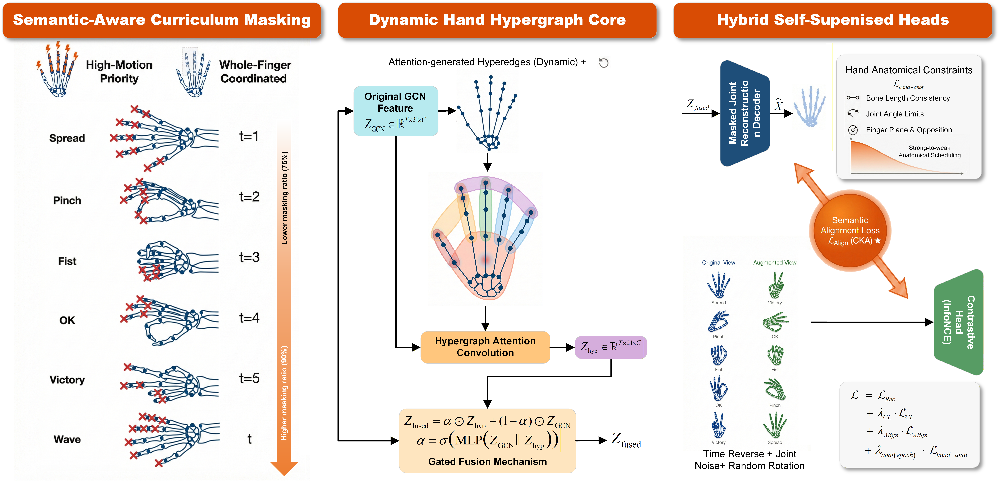

# HGC-MAE: Anatomically-Constrained Dynamic Hypergraph Masked Autoencoder

[](https://opensource.org/licenses/MIT)
[](https://pytorch.org/)
[](https://github.com/)

> **HGC-MAE: Anatomically-Constrained Dynamic Hypergraph Masked Autoencoder for Self-Supervised Hand Gesture Recognition**

## 📖 Introduction

**HGC-MAE** is a proposed self-supervised learning framework designed to address the limitations in existing skeleton-based action recognition methods, specifically focusing on **physical inconsistency** in reconstructions and limited **topological modeling** of complex hand interactions.

By integrating dynamic hypergraphs with anatomically constrained masked autoencoding, HGC-MAE aims to learn richer, physically plausible representations for hand gestures without relying on manual annotations.

### Proposed Framework

<div align="center">
  
</div>

<br>

> **Figure 1: Overview of the proposed HGC-MAE framework.**
> The architecture consists of three key modules corresponding to the panels above:
> 1.  **Left Panel (Input):** Semantic-Aware Curriculum Masking applied to the input skeleton sequence, prioritizing high-motion areas and coordinating whole-finger masking with an increasing ratio over time.
> 2.  **Middle Panel (Encoder):** The Dynamic Hand Hypergraph Core. It augments original GCN features by generating dynamic hyperedges via attention to capture high-order finger synergies, fusing them through a Gated Fusion Mechanism.
> 3.  **Right Panel (Hybrid Heads & Optimization):** The framework employs hybrid self-supervised heads. The **Masked Joint Reconstruction Decoder** is supervised by physical rules with **Strong-to-weak Anatomical Scheduling** (bone length, joint angles, planarity). Simultaneously, a **Contrastive Head** learns discriminative features. A crucial **Semantic Alignment Loss (CKA)** bridges the semantic gap between the reconstruction and contrastive latent spaces.

---

## 🌟 Key Methodology Highlight

Based on the architectural design depicted above, our method incorporates four distinct mechanisms:

### 1. Semantic-Aware Curriculum Masking (Left Panel)
Instead of random masking, we propose a strategy that utilizes motion priors (optical flow) to prioritize masking regions with high semantic information, such as "High-Motion" joints or "Whole-Finger" groups. A curriculum schedule gradually increases the masking ratio as training progresses.

### 2. Dynamic Hand Hypergraph Core (Middle Panel)
To move beyond fixed point-to-point graph topologies, we introduce a hypergraph convolution module. It dynamically generates hyperedges via attention mechanisms to model complex, instantaneous synergies between finger groups (e.g., pinching motions), fusing these global contextual features with local GCN features via a learnable gate.

### 3. Anatomically-Constrained Reconstruction (Right Panel, Top)
Standard MAE can lead to biologically impossible poses. Our decoder integrates explicit **Hand Anatomical Constraints**, including bone length consistency, joint angle limits, and finger planarity. A "Strong-to-Weak" scheduling strategy enforces hard physical rules early in training and relaxes them later for fine-tuning.

### 4. Hybrid Semantic Alignment (Right Panel, Bottom)
We address the potential semantic misalignment between generative (reconstruction) and discriminative (contrastive) tasks in hybrid SSL. By explicitly minimizing the **Centered Kernel Alignment (CKA) loss** between the reconstruction features and projection features, we theoretically align their semantic distributions.

---

## 🚧 Status & Experiments

**This project is currently under active development.**

Extensive experiments are being conducted on standard benchmarks including **NTU RGB+D 60/120** and **SHREC'17 Track**. We are evaluating the model's performance on linear evaluation, fine-tuning, and robustness capabilities.

*Detailed quantitative results and comparative analysis will be updated here upon completion of the experiments.*

---

## 🛠️ Installation (Preliminary)

### Requirements
- Python >= 3.8
- PyTorch >= 1.12
- CUDA Check

```bash
# Clone the repository
git clone [https://github.com/YourUsername/HGC-MAE.git](https://github.com/YourUsername/HGC-MAE.git)
cd HGC-MAE

# Install dependencies
pip install -r requirements.txt